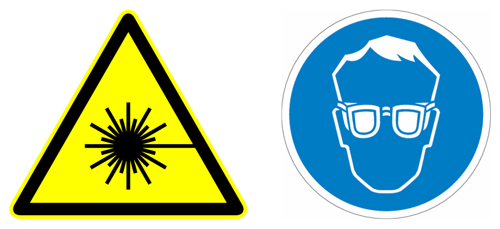

# Laser Safety for openSIMMO Users

## Introduction to Laser Safety

The openSIMMO module utilizes laser technology for structured illumination microscopy, which significantly enhances the resolution capabilities of conventional epi-fluorescence microscopes. Laser safety is crucial in maintaining a safe working environment and ensuring the protection of all individuals handling or exposed to the equipment. This section outlines the essential safety measures and guidelines for using lasers with the openSIMMO system.

**Laser Safety Guidelines**

1. **Laser Classification:**
   The openSIMMO employs Class 3B lasers, which emit wavelengths of 488 nm and 635 nm. These lasers can be hazardous and potentially cause eye damage if not handled properly. Understanding the classification helps in applying appropriate safety measures.

2. **Personal Protective Equipment (PPE):**
   - **Safety Goggles:** Always wear laser safety goggles that are specifically designed to block or attenuate the wavelengths used (488/635 nm). This is mandatory to prevent accidental exposure to the eyes.
   - **Protective Clothing:** Wear lab coats to protect your skin from lesser hazards like accidental reflections.

3. **Engineering Controls:**
   - **Laser Enclosures:** Ensure that the laser beams are enclosed as much as possible. Use laser curtains or screens to contain the beam path in open areas.
   - **Interlocks:** Equip doors and access panels with interlocks to prevent inadvertent exposure when the laser is operational.

4. **Administrative Controls:**
   - **Training:** All personnel must receive training on laser safety, the specific hazards associated with the lasers in use, and the correct use of safety features and PPE.
   - **Standard Operating Procedures (SOPs):** Develop and adhere to SOPs for tasks involving lasers. These should include step-by-step safety measures, startup, and shutdown procedures.

5. **Warning Signs and Labels:**
   - Place warning signs at all laboratory entrances and on the laser equipment itself. The signs should indicate the laser class and the required PPE.
   - Labels should clearly state the wavelength, maximum output, and optical density requirements for the safety goggles.

6. **Maintenance and Inspections:**
   - Regularly inspect lasers and safety equipment for any signs of damage or malfunction. Promptly address any issues to prevent accidents.
   - Keep maintenance logs to track the condition and service history of the laser equipment.

7. **Emergency Procedures:**
   - Develop and clearly outline emergency procedures for potential laser accidents. Include instructions for dealing with eye exposure and fires.
   - Ensure that all personnel know the location of first aid kits and emergency equipment.

## Disclaimer

The information provided in this safety guide is for educational and instructional purposes only. We do not accept responsibility for any harm or injury resulting from improper use or failure to follow safety guidelines outlined herein. It is mandatory that all personnel involved in the operation of the openSIMMO system use appropriate protective equipment at all times and adhere strictly to the safety protocols established in their respective organizations.

## Conclusion

Adhering to these laser safety guidelines is essential for safely operating the openSIMMO system. By implementing these safety measures, users can protect themselves and others from the potential risks associated with laser use in microscopy. Always prioritize safety and ensure compliance with institutional and regulatory safety standards.
