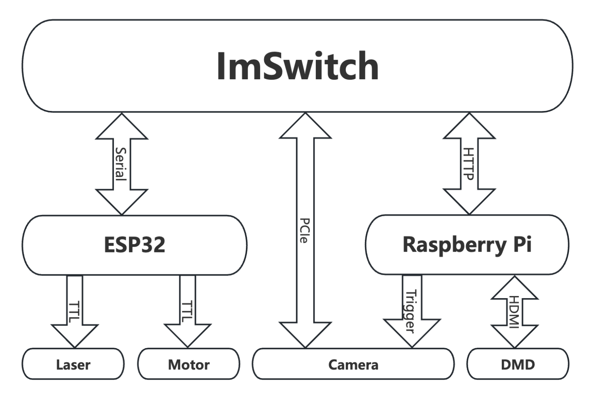
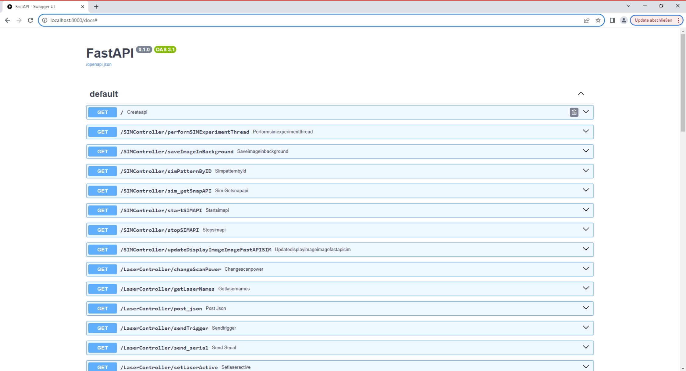

# Electronics

In order to display SIM patterns on the DMD and trigger the camera, we would need to connect it to a Raspberry Pi that itself acts as a display server and realizes a fast trigger and display rate for reasonalbe framerates in SIM experiments. For this, we build a fastapi-driven Server that loads and displays images using openCL accelerated pygame. The latest version of the display server can be found [here](https://github.com/openUC2/ImSwitch/blob/SIM_PCO/tools/fastapiSIM.py). A step-by-step code explenation follows below.

The system is modular and can be adapted or extended for various imaging and display applications. The integration of web control via FastAPI makes it versatile for remote operation, potentially in laboratory settings where automated image display and capture are required. ImSwitch adapts the fastapi REST-API and triggers the display of certain display sequences.



## Install the dependencies

```bash
pip3 install GPIO
pip3 install fastapi
pip3 install pyzmq
pip3 install pygame
pip3 install uvicorn
```

## Python display server

[Latest fastapi.py code](https://github.com/openUC2/ImSwitch/blob/SIM_PCO/tools/fastapiSIM.py).

```py
import zmq
import numpy as np
import pygame
import time
import os
import socket
from os import listdir
from os.path import isfile, join
from threading import Thread, Event
from fastapi import FastAPI, BackgroundTasks
import uvicorn

ZMQPORT = 5555
IS_FULLSCREEN = False
nImages = 9
CAM_TRIGGER_PIN = 37

# Configure GPIO if running on Raspberry Pi
try:
    import RPi.GPIO as GPIO
except:
    print("Not running on Pi")
    GPIO = None

if GPIO is not None:
    # List of pins your application uses
    pins_to_cleanup = [CAM_TRIGGER_PIN]

    # Clean up specific pins
    GPIO.setmode(GPIO.BOARD)  # or GPIO.BOARD, depending on your pin numbering
    for pin in pins_to_cleanup:
        GPIO.setup(pin, GPIO.IN)  # Set pin to input to safely unexport it
    GPIO.cleanup(pins_to_cleanup)  # Clean up only the pins you plan to use

    # Now, set up your GPIO pins as usual
    print("Setting up pin: ")
    GPIO.setup(CAM_TRIGGER_PIN, GPIO.OUT)

class ViewerController:
    def __init__(self):
        self.context = zmq.Context()
        # Use REQ socket for request-reply pattern
        self.socket = self.context.socket(zmq.PAIR)
        self.socket.bind("tcp://*:"+str(ZMQPORT))
        self.tWait = 0.1

    def send_stop_continous(self):
        self.isRunningContinous = False
        try:
            self.mThread.join(timeout=1)
        except Exception as e:
            print(e)

    def send_stop_viewer(self):
        self.send_command("stop")

    def send_command(self, command):
        return self.send_command_and_receive(command)

    def send_command_and_receive(self, command):
        # clear messages in the socket
        while self.socket.poll(0):
            print(self.socket.recv_string(zmq.NOBLOCK))

        self.socket.send_string(command)
        # Block until a reply is received
        message = self.socket.recv_string()
        return message

    def display_continous(self):
        self.isRunningContinous = True
        def runPatternDisplayThreadFunction():
            while(self.isRunningContinous):
                for pattern_id in range(nImages): #len(self.current_images)):
                    if not self.isRunningContinous:
                        return
                    self.display_pattern(pattern_id)
                    self.send_trigger()
                    print(str(pattern_id))
                    time.sleep(self.tWait)
        self.mThread = threading.Thread(target=runPatternDisplayThreadFunction).start()

    def display_pattern(self, pattern_id):
        self.send_command(f"display:{pattern_id}")

    def change_wavelength(self, wavelength):
        self.send_command(f"change_wavelength:{wavelength}")

    def set_wait_time(self, tWait):
        self.tWait = tWait

    def start_single_loop(self, i_cycle):
        self.send_command(f"start_single_loop:{i_cycle}")

    def send_trigger(self):
        self.send_command(f"trigger")

class ImageLoader:
    def __init__(self, path_488, path_635, n_images=9):
        self.path_488 = path_488
        self.path_635 = path_635
        self.n_images = n_images
        self.images_488 = self.load_images(self.path_488)
        self.images_635 = self.load_images(self.path_635)

    def load_images(self, path):
        images = []
        try:
            image_files = sorted([f for f in listdir(path) if isfile(join(path, f))])
            for i in range(self.n_images):
                images.append(pygame.image.load(join(path, image_files[i])))
            print("Images loaded successfully.")
        except Exception as e:
            print(f"Failed to load images: {e}")
            # Handle error or generate random patterns
        return images

app = FastAPI()
viewer_controller = ViewerController()

class PygameViewer:
    def __init__(self, display_size, path_488, path_635):
        self.display_size = display_size
        self.loader = ImageLoader(path_488, path_635)
        # Initialization of pygame and zmq as before
        self.context = zmq.Context()
        self.socket = self.context.socket(zmq.PAIR)
        self.socket.connect("tcp://localhost:"+str(ZMQPORT))
        self.current_images = self.loader.images_488  # Default to 488nm images
        self.tWait = 0.1  # Default time to wait between patterns
        self.isRunningContinous = False
        self.mLock = threading.Lock()

    def run(self):
        os.environ["DISPLAY"] = ":0"
        pygame.display.init()
        pygame.init()
        if IS_FULLSCREEN:
            self.display = pygame.display.set_mode(self.display_size, pygame.FULLSCREEN)
        else:
            self.display = pygame.display.set_mode(self.display_size)
        pygame.mouse.set_visible(False)
        self.running = True
        while self.running:
                # Check for Pygame events
                for event in pygame.event.get():
                    if event.type == pygame.QUIT:  # Allows quitting by closing the window
                        self.running = False

                # Non-blocking check for a message from ZMQ
                try:
                    # Wait for next request from client
                    message = self.socket.recv_string(zmq.NOBLOCK)
                    reply = self.handle_message(message)
                    # Send reply back to client
                    self.socket.send_string(reply)

                except zmq.Again:
                    pass  # No message received

                pygame.display.flip()  # Update the full display surface to the screen
                pygame.time.wait(10)  # Small delay to prevent high CPU usage

    def handle_message(self, message):
        response = ""
        if message.startswith("display:"):
            pattern_id = int(message.split(":")[1])
            self.display_pattern(pattern_id)
        elif message.startswith("change_wavelength:"):
            wavelength = int(message.split(":")[1])
            self.change_wavelength(wavelength)
        elif message == "start":
            self.start()
            # hreading.Thread(target=self.start).start()
        elif message == "stop":
            self.running = False
        elif message == "trigger":
            self.trigger()
        elif message.startswith("start_single_loop"):
            self.start_single_loop(int(message.split(":")[1]))
            response = "Current pattern info or any other data"
        return response

    def trigger(self, gpiopin=CAM_TRIGGER_PIN):
        # Perform trigger action
        GPIO.output(gpiopin, GPIO.HIGH)
        time.sleep(0.001)
        GPIO.output(gpiopin, GPIO.LOW)
        time.sleep(0.001)


    def display_pattern(self, pattern_id):
        with self.mLock:
            if pattern_id < len(self.current_images):
                image = self.current_images[pattern_id]
                self.display.blit(image, (0, 0))  # Draw the image to the display
                #pygame.display.flip()  # Refresh the display seems not work
                pygame.display.update()
            else:
                print("Pattern ID out of range")

    def change_wavelength(self, wavelength):
        if wavelength == 488:
            self.current_images = self.loader.images_488
            print("wl is 488")
        elif wavelength == 635:
            self.current_images = self.loader.images_635
            print("wl is 635")
        else:
            print("Unsupported wavelength")

    def start(self): # how to deal with it
        self.isRunningContinous = True
        def runPatternDisplayThreadFunction():
            while(self.isRunningContinous):
                for i in range(len(self.current_images)):
                    if not self.isRunningContinous: break
                    self.display_pattern(i)
                    self.trigger()
                    print(str(i))
                    time.sleep(self.tWait)
        #threading.Thread(target=runPatternDisplayThreadFunction).start()
        #runPatternDisplayThreadFunction()

    def start_single_loop(self, cycle):
        # display each pattern once and perform a trigger action
        print("Start Single Loop: "+str(cycle))
        for cyc in range(cycle):
            for i in range(len(self.current_images)):
                self.display_pattern(i)
                self.trigger()
                print(str(i))
                time.sleep(self.tWait)
            self.display_pattern(0) #go back to default pattern


@app.get("/display_pattern/{pattern_id}")
async def display_pattern(pattern_id: int):
    viewer_controller.display_pattern(pattern_id)
    return {"message": f"Displaying pattern {pattern_id}."}

@app.get("/start_viewer/")
async def start_viewer():
    #def startContinousFct():
    #    viewer_controller.send_command("start")
    #threading.Thread(target=startContinousFct).start()
    #startContinousFct()
    viewer_controller.display_continous()
    return {"message": "Viewer started."}

@app.get("/stop_viewer/")
async def stop_viewer():
    viewer_controller.send_stop_continous()
    return {"message": "Viewer stopped."}

# Corresponding FastAPI endpoint
@app.get("/change_wavelength/{wavelength}")
async def change_wavelength(wavelength: int):
    viewer_controller.change_wavelength(wavelength)
    return {"message": f"Wavelength changed to {wavelength}nm."}

@app.get("/start_viewer_single_loop/{i_cycle}")
async def start_viewer_single_loop(i_cycle: int):
    viewer_controller.start_single_loop(i_cycle)
    #response = viewer_controller.send_command_and_receive("start_single_loop")
    return {"message": "Viewer started in single loop mode."}

@app.get("/set_wait_time/{tWait}") # fix it
async def set_wait_time(tWait: float):
    viewer_controller.set_wait_time(tWait)
    return {"message": f"Wait time set to {tWait}."}

# Implement other endpoints similarly, using viewer_controller to send appropriate commands

PATH_488 = "/home/pi/Desktop/Pattern_SIMMO/488"
PATH_635 = "/home/pi/Desktop/Pattern_SIMMO/635"
DISPLAY_SIZE = (1920, 1080)  

import threading
if __name__ == "__main__":
    def startServer():
        uvicorn.run(app, host="0.0.0.0", port=8000)

    def startViewer():
        viewer = PygameViewer(DISPLAY_SIZE, PATH_488, PATH_635)
        viewer.run()        
    threading.Thread(target=startServer).start()
    startViewer()
```
### Explanation

#### Preparation of the raspberry pi server

This code is part of a software package designed to control an imaging system, potentially for scientific research purposes. It integrates several components, including hardware control, image processing, and server communication, to create an automated and interactive system for displaying and capturing images. The code is written in Python and makes use of several libraries, including ZeroMQ (zmq) for messaging, NumPy for numerical operations, Pygame for image display, FastAPI for serving a web interface, and optionally RPi.GPIO for controlling Raspberry Pi GPIO pins. Below is a detailed documentation of the various components of this system.

The software consists of multiple classes and functions that work together to control the display of images, potentially capture images with a camera, and interact with the user or other systems via a web interface. It is structured to run on a Raspberry Pi, leveraging GPIO pins for hardware control, but it can also be run on other systems with slight modifications.

#### ZeroMQ (ZMQ) Messaging

- ZeroMQ is used for inter-process communication between the different components of the system. It allows for sending commands and receiving responses between the image display controller and the viewer interface.

#### Pygame for Image Display

- Pygame is utilized for loading and displaying images on a screen. It is capable of running in fullscreen mode for immersive viewing experiences or in a windowed mode for debugging and development.

#### FastAPI Web Server

- FastAPI is employed to create a web interface for remotely controlling the imaging system. This allows users to start and stop the viewer, change displayed images or patterns, and adjust system settings through HTTP requests.

#### Raspberry Pi GPIO (Optional)

- If running on a Raspberry Pi, the script includes an option to use RPi.GPIO for controlling General Purpose Input/Output (GPIO) pins. This is useful for triggering external devices, such as cameras, in sync with image display.

#### `ViewerController`

- Manages the communication between the web server (FastAPI) and the image viewer (Pygame) using ZMQ messaging.
- Includes functions to send various commands (`send_command`), such as stopping the viewer, changing displayed images, and adjusting settings.

#### `ImageLoader`

- Loads and stores images from specified directories for two different wavelengths (488nm and 635nm), supporting easy switching between different image sets based on experimental requirements.

#### `PygameViewer`

- Initializes and controls the Pygame window for displaying images.
- Handles messages from the `ViewerController` to update the displayed image, change wavelengths, or trigger external devices using GPIO pins.

#### FastAPI Endpoints

- The web server exposes several endpoints for interacting with the imaging system, such as `/display_pattern/{pattern_id}` for displaying a specific image pattern, and `/start_viewer/` for starting the continuous display mode.

### GPIO Configuration and Cleanup

- If running on a Raspberry Pi, the script attempts to import RPi.GPIO. If successful, it sets up and cleans specific GPIO pins used by the application, ensuring safe operation and shutdown.

### Running the System

- The script is designed to be run as the main entry point of the application. It initializes and starts both the FastAPI web server and the Pygame viewer in separate threads, allowing them to operate concurrently.


### Launch server on startup

The DMD we used accepts HDMI input, so we need to use the DMD as the screen of a raspberry pi, a FastAPI server will direct start on the raspberry pi while it boots. For that we need to modify some code on rapsberry pi and let the FastAPI server will automatic start.

Connect the raspberry pi to a normal screen and boot it. Open the terminal of and using the command

``sudo nano /etc/rc.local``

then add this code before ``exit 0``

``python /home/pi/Desktop/fastapiSIM.py &``

Quit and save the file. Based on the code, we need to copy the [``fastapiSIM.py``](./Code/fastapiSIM.py) and also the whole [folder](./Pattern_SIMMO) for the patterns to the desktop of pi.

Using a ethernet cable to connect the raspberry pi to the computer and reboot the raspberry pi.

After the raspberry pi rebooted, we should see the desktop screen on the DMD and can access the server via

``http://localhost:8000/docs#``



## Camera trigger

The camera has an external trigger come from the raspberry pi, currently, the trigger is provided by GPIO port 26. Use a BNC to jumper cable to connect **GPIO26** and **GND** on pi board to the trigger input of camera.
