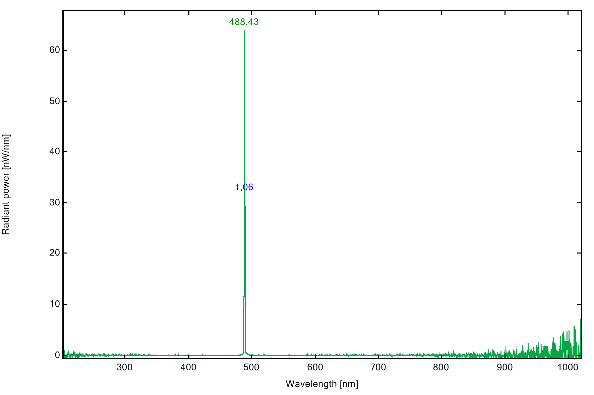
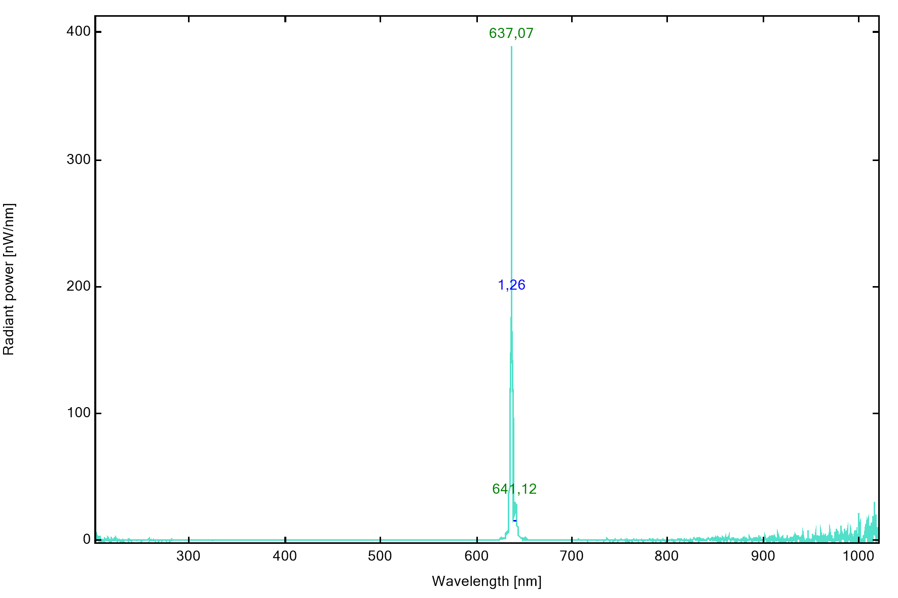

# Laser

## Selection of the laser

we used two single mode fiber coupled diode lasers with the wavelength of 488nm and 635nm in the setup. They were bought from [openUC2](www.openuc2.com). The output power of the laser are 30mW and 60mW.

## Spectrum
Both laser spectrum is measured with spectrometer direct after the coupling fiber. Both lasers have nice peak wavelength with narrow band. The spectrum is shown as following:

The laser diodes are fabricated from Sharp. For the details about the laser diodes, there are datasheet available [here](./Documents/)

## Source

You can buy these laser sources from [openUC2](www.openuc2.com)

