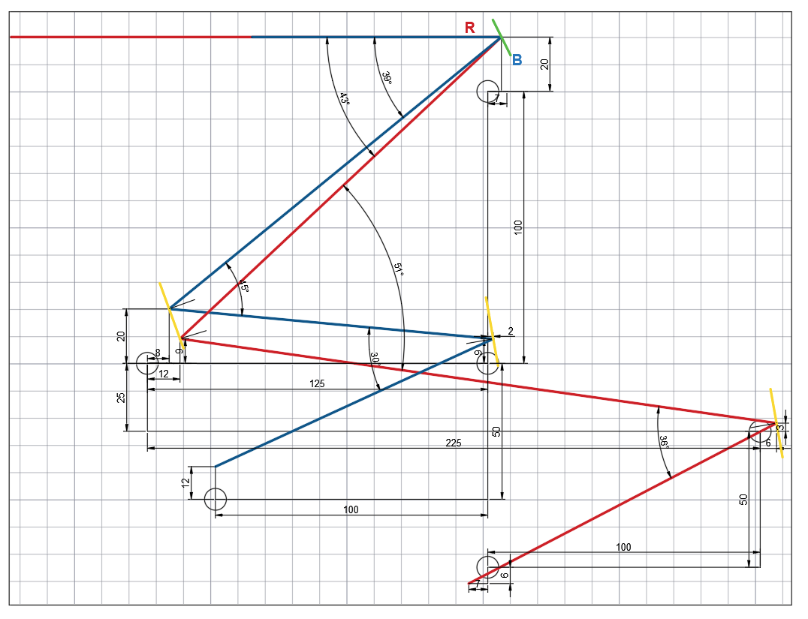

## Preparation

This documentation is designed to help you replicate our setup and understand the components and files required for the project. The openSIMMO project integrates 3D printed parts, laser-cut enclosures, and various accessories to create a customizable optomechanical system.
To replicate this setup, you will need to prepare components in the following categories: 3D printed parts, laser-cut enclosures, and accessories. Detailed design files can be found in the [design-files repository](https://github.com/openSIMMO/openSIMMO/).

### Large Parts & Housing

The housing and large parts of the system are manufactured using laser cutting. Additionally, we use holders for commercial optomechanics, which are 3D printed to ensure system stability.

## Optomechanics

To maintain system stability, certain optomechanical components with fine adjustabilities are necessary and cannot be replaced. We utilize a combination of Thorlabs parts and 3D printed components, including kinematic mirror mounts, 1-inch cage plates, and XY translation stages. An in-depth list of all the components used in our design can be found in the [Bill of Materials](./02_1_BillOfMaterials.md).

## 3D Printing Files

All components were printed with 100% infill in PLA using a 0.2mm layer height on a Prusa i3 mk2.

- **Download All 3D Printing Files:** [STL.zip](https://github.com/openSIMMO/openSIMMO/raw/master/STL/STL.zip)

### Table of 3D Printing Files

| File Name | Description |
|-----------|-------------|
| [STL File](https://github.com/openSIMMO/openSIMMO/tree/master/STL/Assembly_SIMMO_1_10_Mountinplate_Mirrors_v0_18.stl) | Kinematic mirror mounts x4 |
| [STL File](https://github.com/openSIMMO/openSIMMO/tree/master/STL/Assembly_SIMMO_1_Adapter_DMD_KM100_1.stl) | DMD mount plate x1 |
| [STL File](https://github.com/openSIMMO/openSIMMO/tree/master/STL/Assembly_SIMMO_1_Cover_new_7.stl) | DMD assemblies cover x1 |
| [STL File](https://github.com/openSIMMO/openSIMMO/tree/master/STL/Assembly_SIMMO_1_MCH011_FLASH_BOARD_54.stl) | Special mirror mount x1 |
| [STL File](https://github.com/openSIMMO/openSIMMO/tree/master/STL/Assembly_SIMMO_1_Nikon_Ti2E_3.stl) | Camera mount x1 |
| [STL File](https://github.com/openSIMMO/openSIMMO/tree/master/STL/Assembly_SIMMO_1_RailOptiX_Thorlabs_63.stl) | Nikon Adapter |
| [STL File](https://github.com/openSIMMO/openSIMMO/tree/master/STL/Assembly_SIMMO_1_RailOptiX_Thorlabs_69.stl) | Ray optics mounts x7 |
| [STL File](https://github.com/openSIMMO/openSIMMO/tree/master/STL/Assembly_SIMMO_1_rpi2-top_netfabb_70.stl) | Raspberry Pi 2 top cover x1 |
| [STL File](https://github.com/openSIMMO/openSIMMO/tree/master/STL/Assembly_SIMMO_1_rpi3-bottom_100mm-vesa_netfabb_71.stl) | Raspberry Pi 3 bottom cover x1 |

## Lasercutting Files

The different optical elements are fixed in place according to the provided sketch.

- **Lasercutting Files Location:** [LaserCutting folder](https://github.com/openSIMMO/openSIMMO/tree/master/LaserCutting)

| File Name | Quantity | Description |
|-----------|----------|-------------|
| [Ground board with mounting holes](https://github.com/openSIMMO/openSIMMO/blob/master/LaserCutting/BaseplateSIMMO.dxf) | x1 | Base plate with mounting holes for the setup |
| [Side walls](https://github.com/openSIMMO/openSIMMO/blob/master/LaserCutting/Sidewall_Back1.dxf), [Back2](https://github.com/openSIMMO/openSIMMO/blob/master/LaserCutting/Sidewall_Back2.dxf), [Back3](https://github.com/openSIMMO/openSIMMO/blob/master/LaserCutting/Sidewall_Back3.dxf), [Laser](https://github.com/openSIMMO/openSIMMO/blob/master/LaserCutting/Sidewall_Laser.dxf), [LaserDriver](https://github.com/openSIMMO/openSIMMO/blob/master/LaserCutting/Sidewall_LaserDriver.dxf), [Mirror](https://github.com/openSIMMO/openSIMMO/blob/master/LaserCutting/Sidewall_Mirror.dxf), [Telescope](https://github.com/openSIMMO/openSIMMO/blob/master/LaserCutting/Sidewall_Telescope.dxf), [TelescopeDown](https://github.com/openSIMMO/openSIMMO/blob/master/LaserCutting/Sidewall_TelescopeDown.dxf) | x7 | Side walls for enclosing the system and mounting various components. Includes specific walls for laser, laser driver, mirror, and telescope alignments |

## Design Files

The components are constructed using Inventor 2024 Student edition.

- **Design Files Location:** [INVENTOR folder](https://github.com/openSIMMO/openSIMMO/tree/master/INVENTOR)

## Accessories

The setup also uses 3 standard aluminum profiles to mount the ray optical parts, with lengths of 2 x 100mm and 1 x 150mm.

For further information or if you have any questions, feel free to open an issue in this repository.
