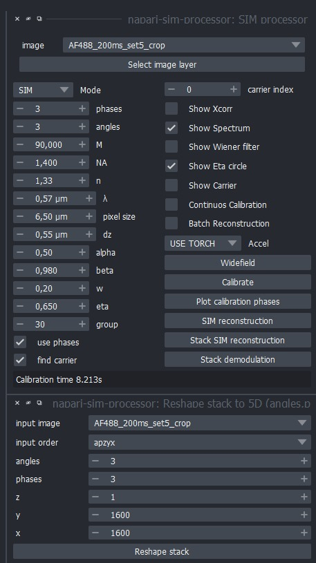

# Reconstruction

Here, we provide a sample dataset that you can reconstruct with the [Napari SIM](https://github.com/andreabassi78/napari-sim-processor) plugin. You can install the latest version by hitting:

`pip install napari-sim-processor`


## Reconstruction Parameters

For the following dataset [Alexa Fluor 488](./img/AF488_200ms_set5_crop.tif), we used the following acquisition parameters:

```
NA: 1.4
Exciation: 488nm
Emission: 520nm
Exposure time: 200ms
Pixelsize: 6.5µm
n: 1.33
angles: 3
phases: 3
```

which need to be entered into the reconstruction software:



A full walkthrough can be watched here:

<iframe width="560" height="315" src="https://www.youtube.com/embed/_4F4oIqGpDE?si=H53RtaPc31t7tRhL" title="YouTube video player" frameborder="0" allow="accelerometer; autoplay; clipboard-write; encrypted-media; gyroscope; picture-in-picture; web-share" referrerpolicy="strict-origin-when-cross-origin" allowfullscreen></iframe>
