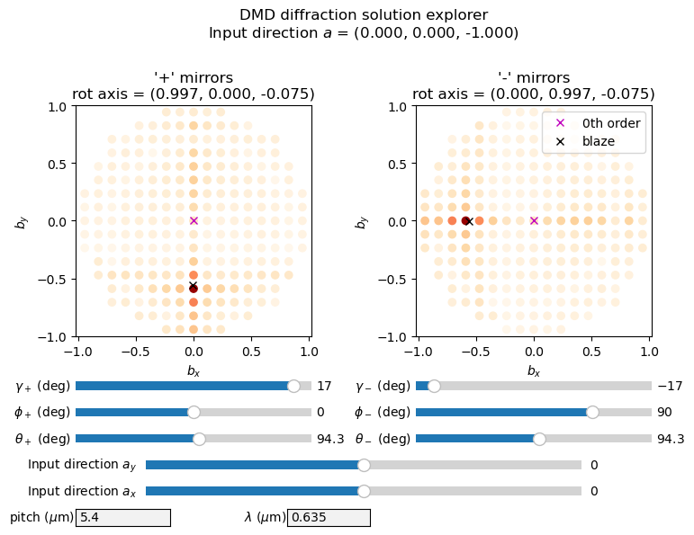

```python
# to display plot in notebook
# to display plot in interactive window
#%matplotlib
from collections.abc import Sequence
import matplotlib.pyplot as plt
from matplotlib.colors import PowerNorm
from matplotlib.widgets import Slider, TextBox
import numpy as np
import mcsim.analysis.simulate_dmd as sdmd


def display_2d(dmd: sdmd.DMD,
               figsize: Sequence[float, float] = (8., 6.),
               cmap: str = "OrRd",
               axcolor: str = "lightgoldenrodyellow",
               n_max_order: int = 20):
    """
    Create manipulatable plot to explore DMD diffraction for different input angles in several colors

    :param dmd: DMD class object
    :param figsize: (size_x, size_y)
    :param cmap: name of matplotlib colormap
    :param axcolor: name of matplotlib color to use when displaying axes
    :param n_max_order: maximum diffraction order to plot
    :return:
    """

    # find zero orders for later
    # diffraction orders to simulate
    dx, dy = np.meshgrid(np.arange(-n_max_order, n_max_order, dtype=int),
                         np.arange(-n_max_order, n_max_order, dtype=int))
    zero_order = np.where(np.logical_and(dx == 0, dy == 0))

    # turn interactive mode off, or have problems with plot freezing
    plt.ioff()

    # plot showing diffraction orders for each input angle, with a moveable slider
    figh = plt.figure(figsize=figsize)

    ncols_half = 4
    grid = figh.add_gridspec(nrows=8,  # define rows
                             height_ratios=[1] + [0.1] + [0.075] * 6,
                             hspace=0.2,
                             bottom=0.02, top=0.8,
                             ncols=ncols_half * 2 + 1,  # define columns
                             wspace=2,
                             width_ratios=[1] * ncols_half + [0.5] + [1] * ncols_half,
                             left=0.1, right=0.9)

    # #####################
    # create axes
    # #####################

    # main plots
    tics = [-1., -0.5, 0.0, 0.5, 1.]
    ax_on = figh.add_subplot(grid[0, :ncols_half])
    ax_off = figh.add_subplot(grid[0, ncols_half + 1:])

    # other plots
    dm_axis = figh.add_subplot(grid[-1, 0:2], facecolor=axcolor)
    wlen_axis = figh.add_subplot(grid[-1, 3:5], facecolor=axcolor)
    slider_axes_x = figh.add_subplot(grid[-2, 1:-1], facecolor=axcolor)
    slider_axes_y = figh.add_subplot(grid[-3, 1:-1], facecolor=axcolor)
    slider_axis_t2 = figh.add_subplot(grid[-6, ncols_half + 1:], facecolor=axcolor)
    slider_axis_phi2 = figh.add_subplot(grid[-5, ncols_half + 1:], facecolor=axcolor)
    slider_axis_theta2 = figh.add_subplot(grid[-4, ncols_half + 1:], facecolor=axcolor)
    slider_axis_t1 = figh.add_subplot(grid[-6, :ncols_half], facecolor=axcolor)
    slider_axis_phi1 = figh.add_subplot(grid[-5, :ncols_half], facecolor=axcolor)
    slider_axis_theta1 = figh.add_subplot(grid[-4, :ncols_half], facecolor=axcolor)

    # start values
    g1_start = dmd.gamma_on * 180/np.pi
    theta1_start = np.arccos(dmd.rot_axis_on[2]) * 180 / np.pi
    phi1_start = np.arctan2(dmd.rot_axis_on[1],
                            dmd.rot_axis_on[0]) * 180 / np.pi

    g2_start = dmd.gamma_off * 180/np.pi
    theta2_start = np.arccos(dmd.rot_axis_off[2]) * 180 / np.pi
    phi2_start = np.arctan2(dmd.rot_axis_off[1],
                            dmd.rot_axis_off[0]) * 180 / np.pi

    # create sliders
    slider_x = Slider(slider_axes_x,
                      'Input direction $a_x$',
                      -1, 1, valinit=0, valstep=0.005)
    slider_y = Slider(slider_axes_y,
                      'Input direction $a_y$',
                      -1, 1, valinit=0, valstep=0.005)
    slider_t1 = Slider(slider_axis_t1,
                       r'$\gamma_+$ (deg)',
                       -20,
                       20,
                       valinit=g1_start,
                       valstep=0.1)

    slider_phi1 = Slider(slider_axis_phi1,
                         r"$\phi_+$ (deg)",
                         -180, 180,
                         valinit=phi1_start,
                         valstep=0.1)

    slider_theta1 = Slider(slider_axis_theta1,
                           r"$\theta_+$ (deg)",
                           0, 180,
                           valinit=theta1_start,
                           valstep=0.1)

    slider_t2 = Slider(slider_axis_t2,
                       r'$\gamma_-$ (deg)',
                       -20,
                       20,
                       valinit=g2_start,
                       valstep=0.1)

    slider_phi2 = Slider(slider_axis_phi2,
                         r"$\phi_-$ (deg)",
                         -180, 180,
                         valinit=phi2_start,
                         valstep=0.1)

    slider_theta2 = Slider(slider_axis_theta2,
                           r"$\theta_-$ (deg)",
                           0, 180,
                           valinit=theta2_start,
                           valstep=0.1)

    dm_box = TextBox(dm_axis, label="pitch ($\mu$m)", initial=str(dmd.dx))
    wlen_box = TextBox(wlen_axis, label="$\lambda$ ($\mu$m)", initial=str(dmd.wavelength))

    def update_dm(val):
        dmd.dx = float(val)
        dmd.dy = float(val)
        update()

    def update_wl(val):
        dmd.wavelength = float(val)
        update()

    # function called when sliders are moved on plot
    def update(val=None):
        ax_on.clear()
        ax_off.clear()

        # get input direction from sliders
        ax_in = slider_x.val
        ay_in = slider_y.val
        az_in = -np.sqrt(1 - ax_in**2 - ay_in**2)
        a_vec = np.stack((ax_in, ay_in, az_in), axis=0)

        # define composite rotations for DMD
        dmd.gamma_on = float(slider_t1.val * np.pi/180)
        dmd.gamma_off = float(slider_t2.val * np.pi/180)

        theta1 = float(slider_theta1.val * np.pi/180)
        phi1 = float(slider_phi1.val * np.pi/180)
        dmd.rot_axis_on = np.array([np.cos(phi1) * np.sin(theta1),
                                    np.sin(phi1) * np.sin(theta1),
                                    np.cos(theta1)])

        theta2 = float(slider_theta2.val * np.pi / 180)
        phi2 = float(slider_phi2.val * np.pi / 180)
        dmd.rot_axis_off = np.array([np.cos(phi2) * np.sin(theta2),
                                     np.sin(phi2) * np.sin(theta2),
                                     np.cos(theta2)])

        # diffraction info
        b_all_diff = sdmd.solve_diffraction_output(a_vec,
                                                   dmd.dx,
                                                   dmd.dy,
                                                   dmd.wavelength,
                                                   dx,
                                                   dy)
        all_diff_int_on = sdmd.blaze_envelope(dmd.wavelength,
                                              dmd.gamma_on,
                                              dmd.wx,
                                              dmd.wy,
                                              b_all_diff - a_vec,
                                              dmd.rot_axis_on) ** 2
        all_diff_int_off = sdmd.blaze_envelope(dmd.wavelength,
                                               dmd.gamma_off,
                                               dmd.wx,
                                               dmd.wy,
                                               b_all_diff - a_vec,
                                               dmd.rot_axis_off) ** 2
        # blaze conditions
        b_on_out = sdmd.solve_blaze_output(a_vec, dmd.gamma_on, dmd.rot_axis_on)
        b_off_out = sdmd.solve_blaze_output(a_vec, dmd.gamma_off, dmd.rot_axis_off)

        #
        figh.suptitle("DMD diffraction solution explorer\n"
                      f"Input direction $a$ = ({a_vec[0]:.3f}, "
                       f"{a_vec[1]:.3f}, "
                       f"{a_vec[2]:.3f})")

        # #####################################
        # on-mirrors plot
        # #####################################
        im = ax_on.scatter(b_all_diff[..., 0].ravel(),
                           b_all_diff[..., 1].ravel(),
                           c=all_diff_int_on.ravel(),
                           cmap=cmap,
                           norm=PowerNorm(vmin=0, vmax=1, gamma=0.2))

        # zero diffraction order
        ax_on.plot(b_all_diff[..., 0][zero_order],
                   b_all_diff[..., 1][zero_order],
                   'mx',
                   label="0th order")

        # blaze angle out
        ax_on.plot(b_on_out[:, 0],
                   b_on_out[:, 1],
                   'kx',
                   label="blaze")

        ax_on.set_xlabel('$b_x$')
        ax_on.set_ylabel('$b_y$')
        ax_on.axis("equal")
        ax_on.set_xlim([-1, 1])
        ax_on.set_ylim([-1, 1])
        ax_on.set_title("'+' mirrors\n"
                        f"rot axis = ({dmd.rot_axis_on[0]:.3f}, "
                        f"{dmd.rot_axis_on[1]:.3f}, "
                        f"{dmd.rot_axis_on[2]:.3f})")

        ax_on.set_xticks(tics)
        ax_on.set_yticks(tics)

        # #####################################
        # off-mirrors plot
        # #####################################
        im = ax_off.scatter(b_all_diff[..., 0].ravel(),
                            b_all_diff[..., 1].ravel(),
                            c=all_diff_int_off.ravel(),
                            cmap=cmap,
                            norm=PowerNorm(vmin=0, vmax=1, gamma=0.2))

        # zero order
        ax_off.plot(b_all_diff[..., 0][zero_order],
                   b_all_diff[..., 1][zero_order],
                   'mx',
                   label="0th order")

        # blaze angle out
        ax_off.plot(b_off_out[:, 0],
                    b_off_out[:, 1],
                    'kx',
                    label="blaze")

        ax_off.set_xlabel('$b_x$')
        ax_off.set_ylabel('$b_y$')
        ax_off.axis("equal")
        ax_off.set_xlim([-1, 1])
        ax_off.set_ylim([-1, 1])
        ax_off.set_title("'-' mirrors\n"
                         f"rot axis = ({dmd.rot_axis_off[0]:.3f}, "
                         f"{dmd.rot_axis_off[1]:.3f}, "
                         f"{dmd.rot_axis_off[2]:.3f})")

        ax_off.set_xticks(tics)
        ax_off.set_yticks(tics)
        ax_off.legend()

        figh.canvas.draw_idle()

    # connect slider moves to function
    slider_x.on_changed(update)
    slider_y.on_changed(update)
    slider_t1.on_changed(update)
    slider_t2.on_changed(update)
    slider_phi1.on_changed(update)
    slider_theta1.on_changed(update)
    slider_phi2.on_changed(update)
    slider_theta2.on_changed(update)
    dm_box.on_submit(update_dm)
    wlen_box.on_submit(update_wl)

    # call once to ensure displays something
    update()
    # block, otherwise will freeze after a short time
    plt.show(block=True)

print("This widget simulates the DMD diffraction order intensities\n"
      "due the blaze condition for light incident along the unit vector\n"
      "($a_x$, $a_y$, $a_z$), which can be adjusted with the sliders.\n"
      "Displaying a pattern on the DMD will add additional diffraction orders\n"
      "around each primary diffraction order. The wavelength\n"
      "and DMD pitch can be adjusted by writing in the text boxes. The DMD mirror\n"
      "orientations in the $+$ (on) or $-$ (off) states can be adjusted by changing\n"
      "the rotation axis, parameterized by polar angles $\theta_\pm, \phi_\pm$, and\n"
      "the mirror rotation angles $\gamma_\pm$\n")

dmd = sdmd.DLP4710()
dmd.wavelength = 0.635

with np.errstate(invalid="ignore"):
    display_2d(dmd)

```

