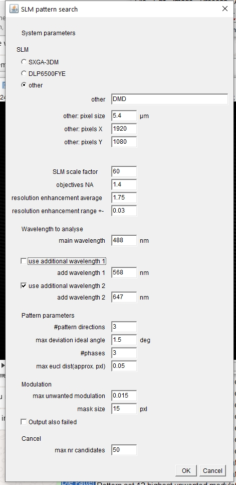
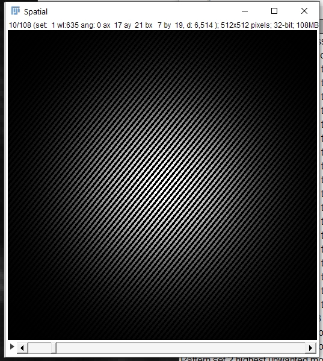

# Computing SIM Patterns

## Overview
This page details the process for pre-computing the gratings necessary for different color and objective lens combinations in SIM applications. These gratings are crucial for effective structured illumination microscopy and can be exported for use in various display systems, such as a Raspberry Pi.

## Requirements
- **Objective Lenses**: 1.4 NA and 0.75 NA on the Nikon TiE
- **Camera**: PCO, Daheng (eff. pixelsize):
- **Light Wavelengths**: 488 nm and 645 nm
- **Resolution Improvement Factor**: 488 nm and 645 nm =>

## Procedure
The gratings are generated based on the optimization of grating orientation and period for a specific unit cell. This optimization uses the results from the algorithm provided by the `fairSIM` project.

Open `Imagej - Plugin - SLM Grating - Search Pattern`, the parameters are shown in the screenshot.

The pattern will be calculated and generated for both 488/635nm laser.

The computed parameters for the 488nm setup are:
**Generate Unit Cell**
- **AX**: 17
- **AY**: 21
**Computed Grating Period**
- **d**: 6,5

Utilize the following code from the `fairSIM` project to compute the necessary parameters and generate the gratings:
- [fastSIM-GratingSearch](https://github.com/fairSIM/fastSIM-GratingSearch)
Export the computed gratings as `.BMP` files and transfer them to the Raspberry Pi for display.

## Video Tutorial
For a detailed visual guide on how to perform these computations and use the generated patterns, please watch the following video:
- [YouTube: SIM Pattern Computation Tutorial](https://www.youtube.com/embed/aXX3RFpRFnk?si=47u4XIKV5_FygkGJ)
