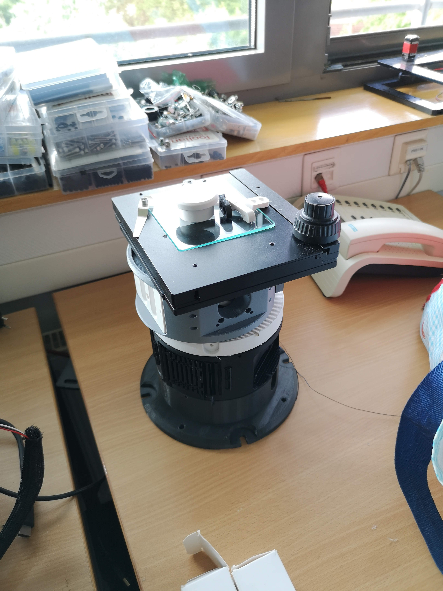
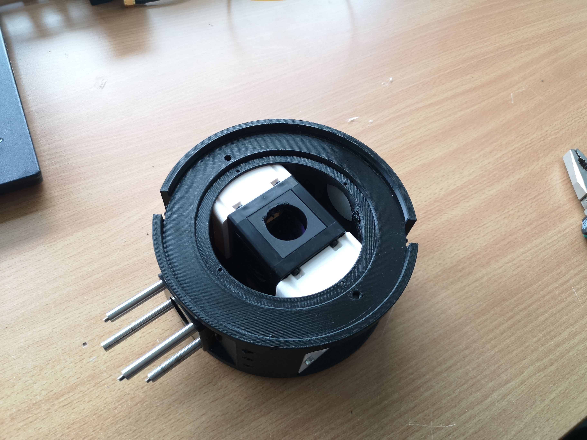
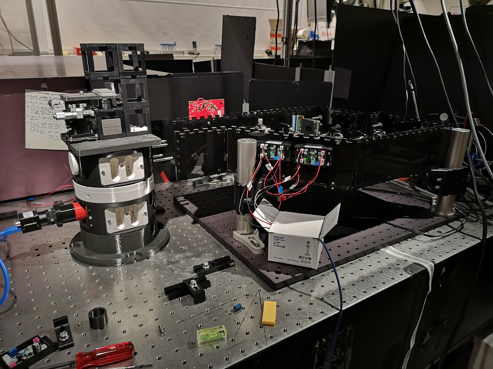
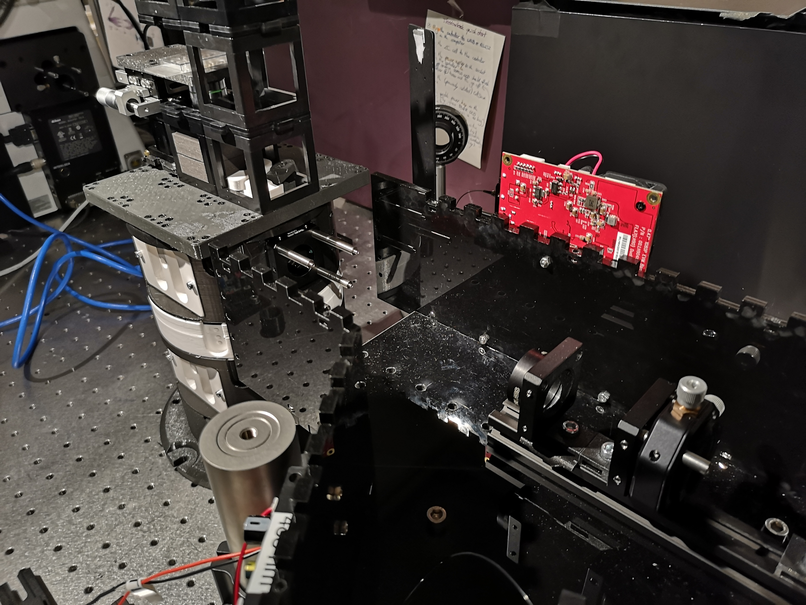
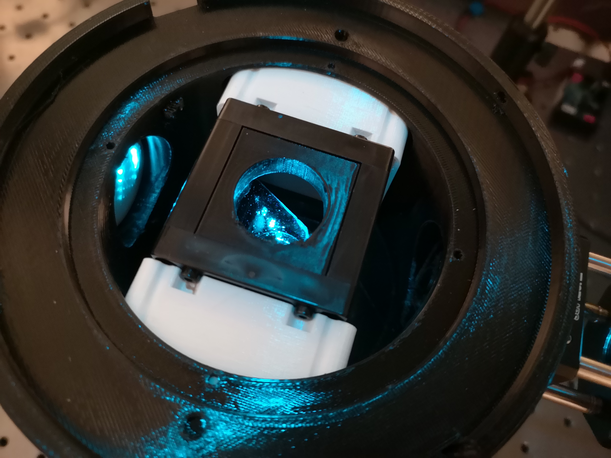
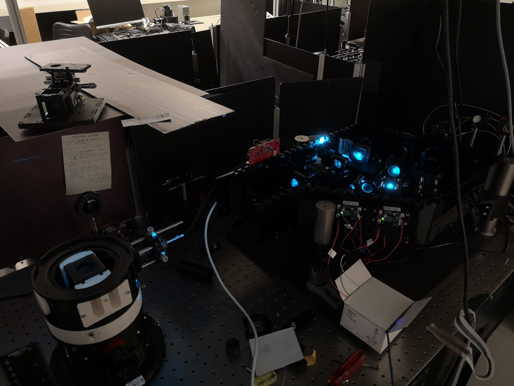
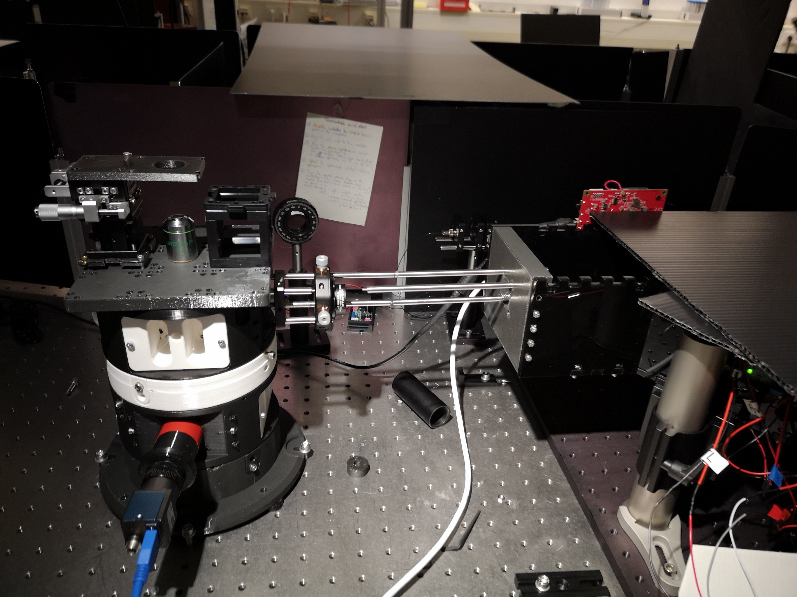
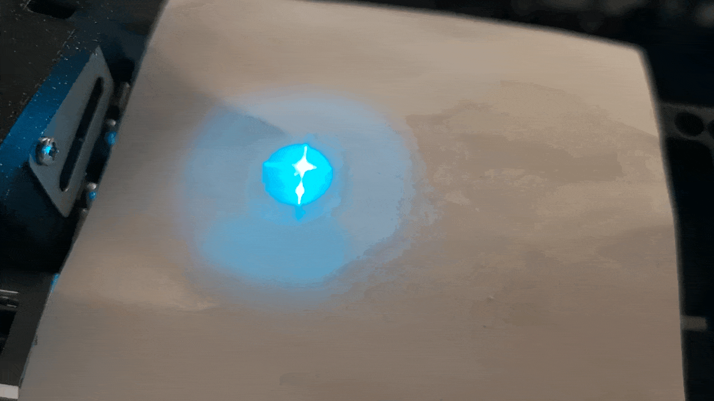
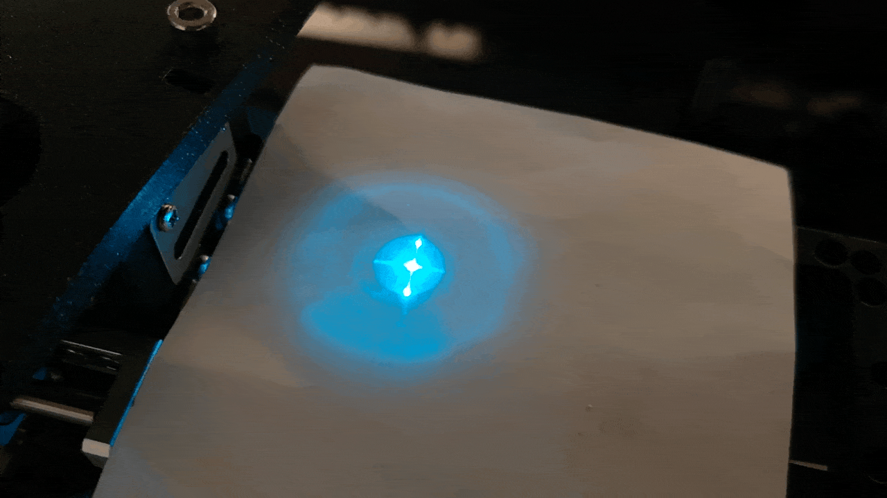
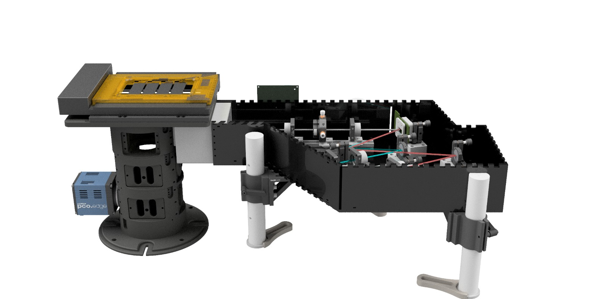

# Integrate openSIMMO into OpenFrame

## Introduction

This tutorial is a work in progress.

We have designed an adapter that integrates the openSIMMO module with the OpenFrame layer. For more information about OpenFrame, you can visit their [GitHub repository](https://github.com/ImperialCollegeLondon/openFrame/wiki/). OpenFrame is a robust, metal-machined multilayer structure, where each layer can serve a different functionality.

In this integration, we replicate an inverse fluorescence microscope, where the fluorescence path is represented by the SIM system. In the current version, we use a Heidstar XY stage. Everything is integrated into imswitch for hardware control, image acquisition, and image processing. All production files will be available soon, and the only additional component needed is a 3D-printed block.

## Prerequisites

Before starting, ensure you have the following:

1. OpenFrame setup.
2. openSIMMO module.
3. Heidstar XY stage.
4. imswitch software.
5. 3D printer (for printing the adapter block).

## Step-by-Step Integration

### Step 1: Prepare OpenFrame

1. Assemble the OpenFrame structure according to the instructions provided in their [wiki](https://github.com/ImperialCollegeLondon/openFrame/wiki/).
2. Ensure each layer is securely fastened and properly aligned.

### Step 2: Print the Adapter Block

1. Download the 3D model file for the adapter block (link will be provided soon).
2. Print the adapter block using a 3D printer. Ensure the dimensions and print quality meet the requirements for a snug fit.

### Step 3: Assemble the Adapter

1. Attach the 3D-printed adapter block to the appropriate layer of the OpenFrame.
2. Secure the openSIMMO module onto the adapter block.

### Step 4: Integrate the Heidstar XY Stage

1. Mount the Heidstar XY stage onto the designated layer of the OpenFrame.
2. Connect the stage to the control system as per the manufacturer's instructions.

### Step 5: Setup imswitch

1. Install imswitch on your control computer if not already installed.
2. Configure imswitch to recognize and control the openSIMMO module and the Heidstar XY stage.
3. Set up the hardware control, image acquisition, and image processing parameters within imswitch.

### Step 6: Test the Integration

1. Power on the system and launch imswitch.
2. Test the movement of the XY stage and ensure the openSIMMO module is functioning correctly.
3. Perform a test image acquisition to verify that the entire setup works seamlessly.

## Pictured Tutorial

We 3D printed the openFrame main bodies using a BambuLab P1P using PETG with 0.2 layer height and 50-80% infill.

**First Prototype:**

**Placing the openUC2 Filter cube inside the OpenFrame with the Two Mounts:**

**Adapting the SIMMOModule next to the printed OpenFrame**

**Roughly aligning the optical axis**

**Careful look into the Beamsplitter plane**

**A 3D printed adapter matches the thorlabs holes of the openFrame to the SIMMO**

**Aligning the SIM orders in the back forcal plane of the OpenFrame:**

*Incorrect:*

*Correct:*

# CAD Files

This folder contains various CAD files for the OpenFrame project. Below is a table summarizing the contents of this folder.

| File Name                                                              | Description                                                 | File Type | Link                                                                                              |
|------------------------------------------------------------------------|-------------------------------------------------------------|-----------|---------------------------------------------------------------------------------------------------|
| 40_XYZstage_micrometer_motorized_nema8_samplemount_angle_distance_24mm.stp | XYZ stage micrometer with motorized NEMA 8 sample mount, angle distance 24mm | STEP      | [40_XYZstage_micrometer_motorized_nema8_samplemount_angle_distance_24mm.stp](./IMAGES/openframe/CAD/40_XYZstage_micrometer_motorized_nema8_samplemount_angle_distance_24mm.stp) |
| Assembly_Cube_Beamsplitter_AHF_v3.stp                                  | Assembly cube with beamsplitter AHF, version 3              | STEP      | [Assembly_Cube_Beamsplitter_AHF_v3.stp](./IMAGES/openframe/CAD/Assembly_Cube_Beamsplitter_AHF_v3.stp) |
| Assembly_Cube_empty_IM_v3.stp                                          | Empty assembly cube, version 3                              | STEP      | [Assembly_Cube_empty_IM_v3.stp](./IMAGES/openframe/CAD/Assembly_Cube_empty_IM_v3.stp)                 |
| NAUO43_Tubelens_156.5_Astromedia.stl                                   | NAUO43 tube lens, 156.5mm, Astromedia                       | STL       | [NAUO43_Tubelens_156.5_Astromedia.stl](./IMAGES/openframe/CAD/NAUO43_Tubelens_156.5_Astromedia.stl)   |
| OF-LL-80 v1.stl                                                        | OpenFrame LL-80, version 1                                   | STL       | [OF-LL-80 v1.stl](./IMAGES/openframe/CAD/OF-LL-80%20v1.stl)                                         |
| OpenFrame - 35mm Blanking Plug.stp                                     | OpenFrame 35mm blanking plug                                 | STEP      | [OpenFrame - 35mm Blanking Plug.stp](./IMAGES/openframe/CAD/OpenFrame%20-%2035mm%20Blanking%20Plug.stp) |
| OpenFrame - Cube Insert_uc2_cube.stl                                   | OpenFrame cube insert UC2 cube                               | STL       | [OpenFrame - Cube Insert_uc2_cube.stl](./IMAGES/openframe/CAD/OpenFrame%20-%20Cube%20Insert_uc2_cube.stl) |
| OpenFrame - SM2 Cmount Plug.stl                                        | OpenFrame SM2 C-mount plug                                   | STL       | [OpenFrame - SM2 Cmount Plug.stl](./IMAGES/openframe/CAD/OpenFrame%20-%20SM2%20Cmount%20Plug.stl)   |
| OpenFrame - Stage Adapter_UC2.stl                                      | OpenFrame stage adapter UC2                                  | STL       | [OpenFrame - Stage Adapter_UC2.stl](./IMAGES/openframe/CAD/OpenFrame%20-%20Stage%20Adapter_UC2.stl)   |
| OpenFrameAdapter_2.stl                                                 | OpenFrame adapter, version 2                                 | STL       | [OpenFrameAdapter_2.stl](./IMAGES/openframe/CAD/OpenFrameAdapter_2.stl)                               |
| OpenFrameAdapter_2.stp                                                 | OpenFrame adapter, version 2                                 | STEP      | [OpenFrameAdapter_2.stp](./IMAGES/openframe/CAD/OpenFrameAdapter_2.stp)                               |

## Conclusion

By following these steps, you can successfully integrate the openSIMMO module into the OpenFrame layer, replicating an inverse fluorescence microscope with a SIM system. Keep an eye out for updates and the release of production files. If you encounter any issues or have questions, feel free to reach out through the relevant GitHub repositories.

