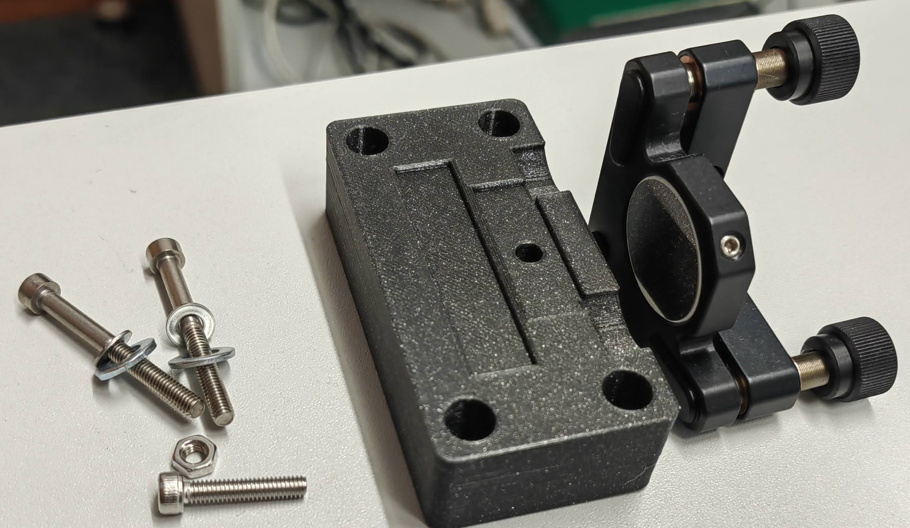

# Assembly

For assembly of the setup, make sure you have all parts in hand. You can compare it in the Bill of material.
A stop motion video was captured showing dismatle and assemble the whole setup.

- Inventor Explosion
- Design Files

## Explosion view

All required components for a SIM extension kit is shwon in this image. We used lots of 3D printed parts to replace the thorlabs optomechanics, the files can be found in this link. The enclosure of the setup is 6mm black plexi glass fabricated with laser cutter, the CAD file is save in this link.

1. Mounting optical component to optomechanics  

The optical elements are all direct connected to optomechanics. It makes sense to fix the optical parts directly in optomechanics. Mirrors are connected to the kinematic mirror mount, put them in the correct position and lock it using the screw on the edge.  

  

Then the kinematic mounts are fixed tightly on the mount plates with long M4 screws and nuts.  

DMD is using similar principle connecting to the mirror mount. Before lock the screw, try to rotate the DMD, make sure the sensor edge remains horizontally.  

Cage plates are connected to a (how does it called) which can hook onto the aluminium profiles with position adjust possibility.

2. Mounting the enclosure side wall to the ground plate

The side walls are connected to the ground board with M3 screws. Screw nuts are placed inside the wall and bonded with the screw. In the side walls, there is one piece slightly different then others, with 2 holes near the zig-zag edge. It is done in purpose, in order to let the laser power cable go through the enclosure. Keep this wall first free until the laser is mounted to the ground board.  

3. Fixing the aluminium profile onto the ground plate

Aluminium profiles are used for laser collimation and conjugated fourier plane. Using hammer nuts and M5 screw to fix profiles on the ground plate. 100mm profiles are used for laser collimation.

4. Mounting the laser

First hook the cage plate with fiber adapter onto the profile, then fix the laser diode cooling onto the ground board. Let the power cable for the laser go through the hole and mount the last side wall onto the board.  

5. Mounting guiding mirrors

6. Mounting DMD

7.

## Unsorted

         DMD                |  Fiber coupled laser
:-------------------------:|:-------------------------:
 |   |  

