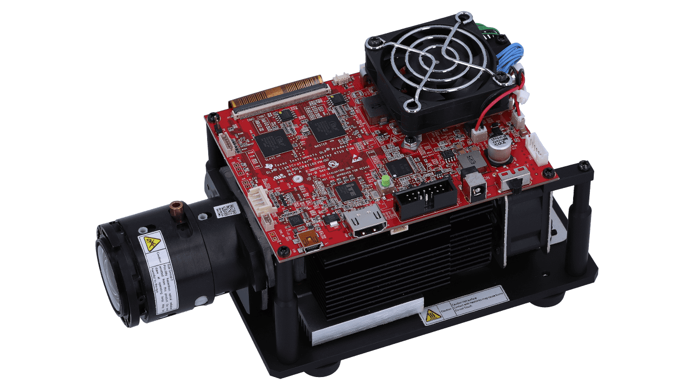

# DMD

More coming soon!

# Modification
We used a DLP4710EVM-G2 video projector as spatial light modulator (SLM) in our setup. The dismantling is inspired by this [paper](https://opg.optica.org/ao/abstract.cfm?uri=ao-60-2-465).

Here is a image how the DLP4710EVM-G2 oringinally looks like. In the projector, what is useful for us is the driver board and DMD chip and its mount. A 3D printed part is used to connect the DMD chip mount with a kinematic mirror mount. A longer flex cable with 40pin/0.5mm pitch is bought separately. The original calbe is quite short and not efficient to mount the driver board away from the DMD.

## flash the driver board firmware
When the driver board is switched on, it will check if all LEDs work correctly. We need to deactivate the LEDs in the firmware. Download [this software](https://www.ti.com/tool/DLPLCRD-GUI) and connect the projecto to computer. Open the software and enter the advanced setting. The firmware accept batch file for modifying the configuration. A batch file is provided [here](./LEDoffCURoff.bf) and load it can disable the LEDs and set the input source with HDMI.

## steps of tear down the DMD projector

- remove the flex cable and 3 LEDs from the driver board
- loosen 4 screws on the driver board and it can now be taken down from the projector frame
- loosen 4 screws beside the DMD mount, be careful, each screw holds two different springs
- take out the DMD chip and place it onto the 3D printed mount
- place the fixation layers onto the DMD respectively
- tight the screws to hold the DMD chip tight
- reconnect the DMD board with the driver board

# Paper

Mitchell A. Cox and Alice V. Drozdov, "Converting a Texas Instruments DLP4710 DLP evaluation module into a spatial light modulator," Appl. Opt. 60, 465-469 (2021)
