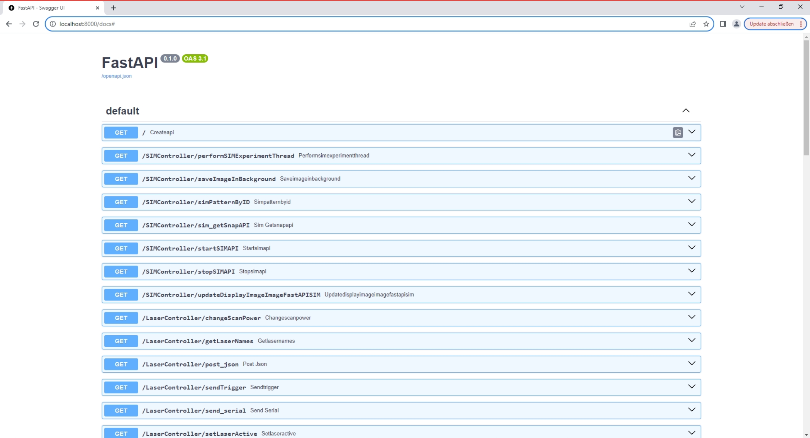

# Electronics

More coming soon!

- Firmware
- Server on Raspberry pi
- Testing
- Board

## preparation of the raspberry pi server

The DMD we used accepts HDMI input, so we need to use the DMD as the screen of a raspberry pi, a FastAPI server will direct start on the raspberry pi while it boots. For that we need to modify some code on rapsberry pi and let the FastAPI server will automatic start.

Connect the raspberry pi to a normal screen and boot it. Open the terminal of and using the command 

``sudo nano /etc/rc.local``

then add this code before ``exit 0``

``python /home/pi/Desktop/fastapiSIM.py &``

Quit and save the file. Based on the code, we need to copy the [``fastapiSIM.py``](./Code/fastapiSIM.py) and also the whole [folder](./Pattern_SIMMO) for the patterns to the desktop of pi.

Using a ethernet cable to connect the raspberry pi to the computer and reboot the raspberry pi.

After the raspberry pi rebooted, we should see the desktop screen on the DMD and can access the server via 

``http://localhost:8000/docs#``

## camera trigger

The camera has an external trigger come from the raspberry pi, currently, the trigger is provided by GPIO port 26. Use a BNC to jumper cable to connect **GPIO26** and **GND** on pi board to the trigger input of camera.

