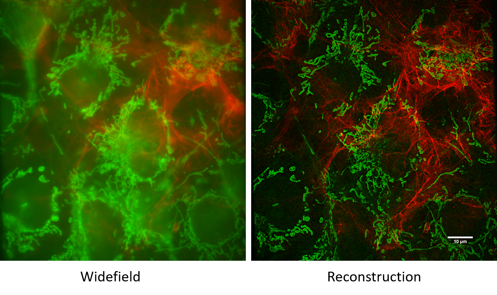

# Introduction

More coming soon!

- Brief Abstract of what this is

here is the tutorial of how to use the open-sourced dual-coloured structured illumination extension designed for general application on epi-fluorescence microscopes.

The step by step tutorial includes

- preparation of all required components
- transform a video projector into spatial light modulator
- assembly the setup
- align the optical path
- introduce into the controlling software ImSwitch

